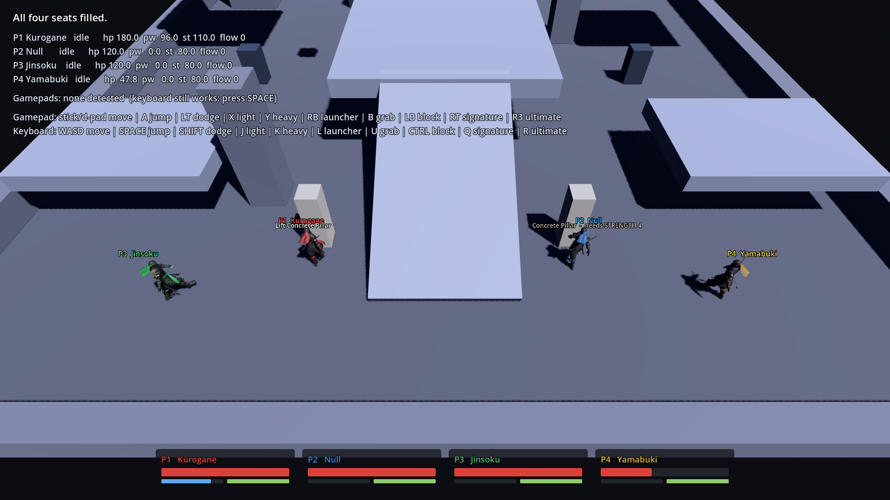
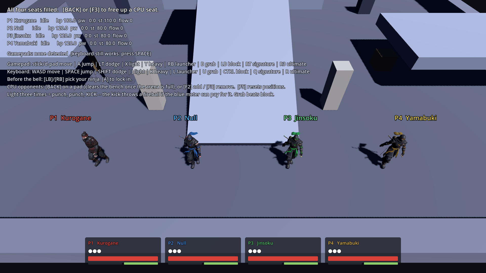
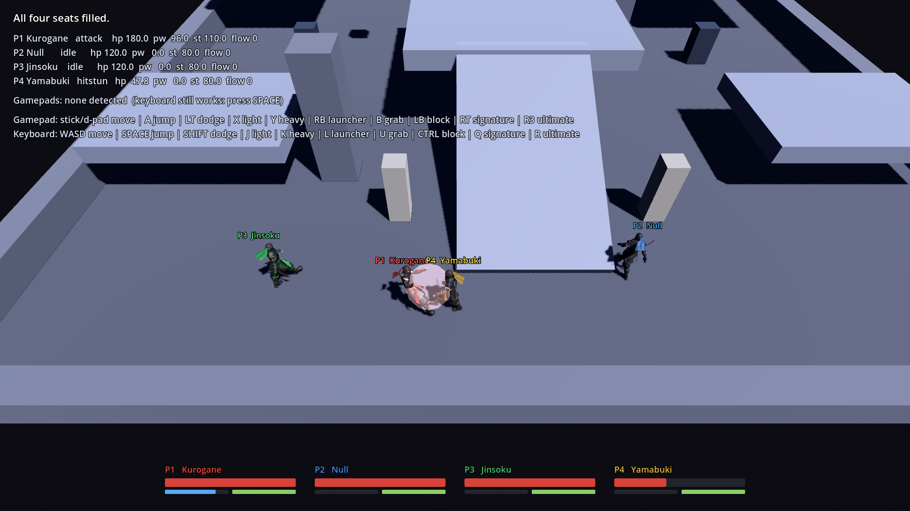
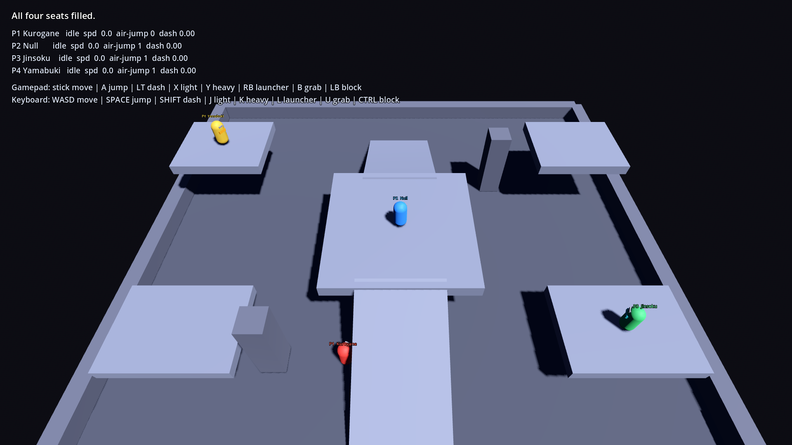
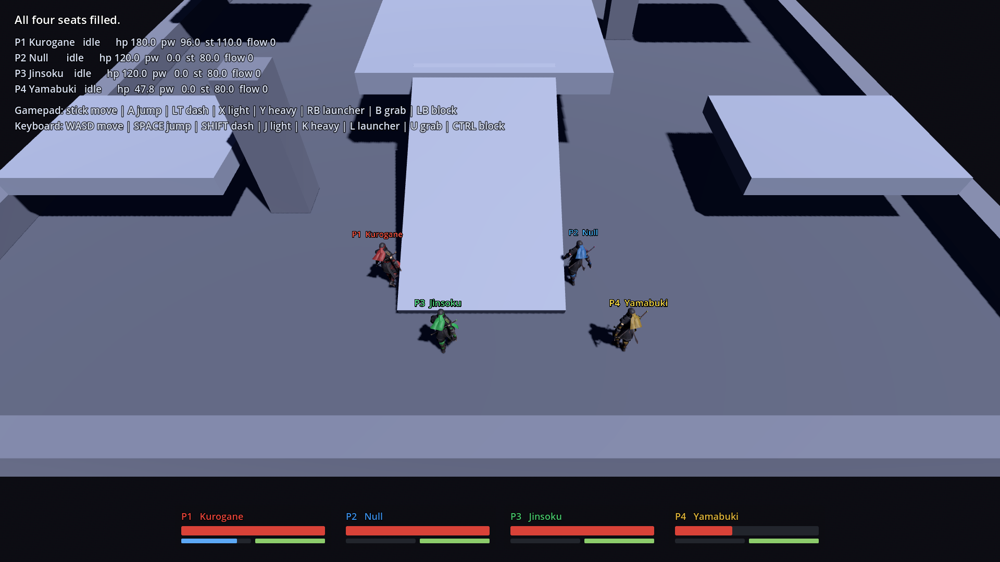
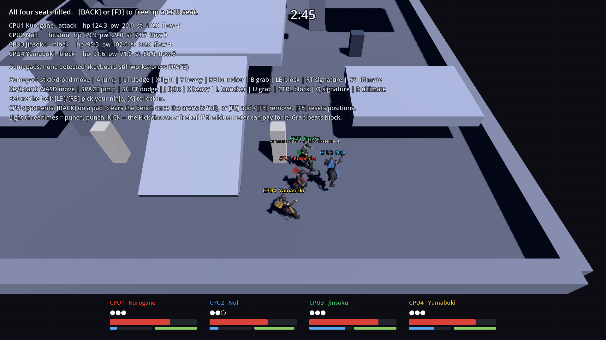
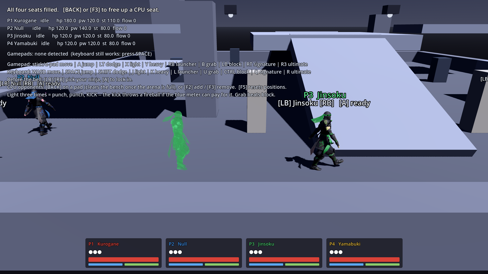
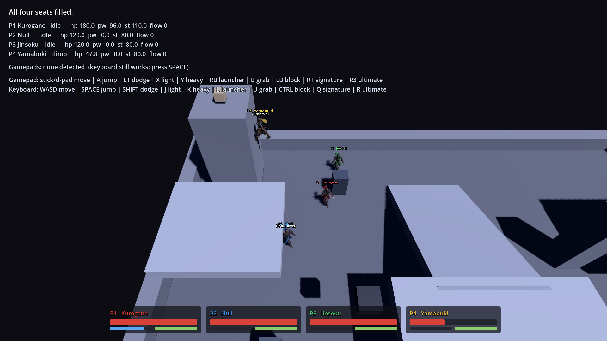

# RumbleArena

A 4-player local versus arena brawler in Godot 4.3. Named ninjas with super
powers tear each other — and the arena itself — apart.

Spiritually a *Marvel Nemesis: Rise of the Imperfects* clone: asymmetric
super-powered fighters in interactive, destructible arenas where what you can
lift, climb, break, or hack is gated by your character's stats.

## Status

**M4 in progress** — a real match now: two or more players, a countdown, three
stocks each, elimination and a winner. Combat is punch-punch-kick chains ending
in a fireball, heavy and launcher confirms, grabs that beat a guard, blocking,
dodging, juggles, knockdowns and wall splats, with timing-based rhythm bonuses.
Pick your ninja in the arena before the bell, and Kurogane and Null have their
named powers on the signature and ultimate buttons. The arena is stat-gated: Kurogane rips out concrete pillars and throws
them, Null hacks the ceiling turrets, Yamabuki climbs the comms tower, and each
is refused what the others can do. A second arena and the rest of the roster's powers are what
remain. See [`docs/ROADMAP.md`](docs/ROADMAP.md).

The same pillar, offered to the fighter who qualifies and refused — with the
requirement named — to the one who does not:



One mesh, one texture, four players — the shader rotates the hue of the crimson
only, so skin and armour stay put:







The camera frames everyone and pushes in when the fight closes up:



Four bots, nobody holding a controller — one attacking, two guarding, one in
hitstun, and CPU2 already down a stock. They play through the same `InputFrame`
a pad fills, so none of that is a special case:



Jinsoku's Afterimage Flurry: she dashes through you, and the decoy is left
standing where she was. Hitting it costs you.



## Design

- **[`docs/GAME_DESIGN.md`](docs/GAME_DESIGN.md)** — pillars, stat system,
  roster, combat, arena interaction, camera, input, architecture, risks.
- **[`docs/ROADMAP.md`](docs/ROADMAP.md)** — milestones and working practices.

## The short version

Six stats (Strength, Speed, Agility, Tech, Focus, Toughness) rated 1–5 act as
**permission checks** on the world, not just damage multipliers. A concrete
pillar declares "STRENGTH 3" — the bruiser rips it out and throws it, the hacker
sees the prompt greyed out and learns what she isn't. Every character has at
least one stat at 4+ and one at 2 or below. There are no well-rounded ninjas.

## Playing it

### Windows — the short version

1. **Download the project:**
   [RumbleArena.zip](https://github.com/jacobf329/RumbleArena/archive/refs/heads/claude/godot-ninja-game-96kjrj.zip)
2. **Right-click the .zip → Extract All.** Windows blocks scripts inside a zip
   until it is extracted, so this step is not optional.
3. **Double-click `Setup.bat`** in the extracted folder.

Setup finds Godot, offers to download it if you do not have it, prepares the
game's assets, and puts a RumbleArena shortcut on your Desktop. After that you
launch from the Desktop icon.

The asset step takes a minute or two and happens whenever the game files have
changed. **Do not skip it by launching Godot by hand** — without an up-to-date
class cache every `class_name` type is unresolved: the autoloads fail to compile
and nothing responds to input, while the arena still renders perfectly. Both
launchers check for this and rebuild automatically.

The check is whether the cache *matches* the scripts on disk, not merely whether
one exists. Replacing a game folder by hand leaves the old cache behind, and an
old cache that has never heard of a class the new code references is exactly as
broken as no cache at all — that is what made a correctly-installed copy sit
there ignoring the controller. If it ever happens again the game says so on
screen instead of looking dead, and `Diagnose.bat` (or `./diagnose.sh`) writes a
`diagnostics.txt` with everything needed to work out why.

### Getting updates

A downloaded zip is a snapshot — it never changes on its own. To pull in
whatever has landed since:

- **Windows** — double-click **`Update RumbleArena.bat`** in the game folder.
- **macOS** — double-click **`Update RumbleArena.command`**.
- **Linux** — run `./update.sh`.

It checks what is published, prints the list of changes you are about to get,
downloads them, and re-imports the assets. Your Godot download, your Desktop
shortcut and the asset cache all survive; only the game itself is replaced.
`--force` re-downloads even when you are already current.

The play launcher also checks on startup and prints one line if there is
something new. It is bounded to a few seconds and does not care if you are
offline; drop a file called `no_update_check.txt` next to the launcher to turn
it off.

If you got the game with `git clone` rather than as a zip, the updater stops and
tells you to `git pull` instead — overwriting a clone's files from a zip would
strip its history and throw away anything you had changed.

### Other platforms, or doing it by hand

1. **Install Godot 4.3** from [godotengine.org/download](https://godotengine.org/download).
   Take the standard version, not .NET. It is a single executable — there is no
   installer to run.
2. **Get this branch:** `git clone` the repo and `git checkout claude/godot-ninja-game-96kjrj`,
   or download the zip above.
3. **Put a shortcut on your Desktop** — run once:
   - Windows → `Setup.bat`
   - macOS / Linux → `./create_desktop_shortcut.sh`

   You can also skip the shortcut and double-click the launcher in the project
   folder directly (`Play RumbleArena.bat`, `Play RumbleArena.command`, or
   `play.sh`).

The launcher looks for Godot on your PATH, beside the project, in the usual
install folders, and in Downloads. If it cannot find it, create a file called
`godot_path.txt` next to the launcher whose only line is the full path to your
Godot executable.

**If it complains about Vulkan**, your GPU or its drivers cannot run the default
renderer. Run the launcher with `--compat` to use OpenGL instead.

You can also just open the project folder in Godot and press play.

Press **A** on a gamepad or **Space** on the keyboard to take a seat; up to four
can join at any time, and a pad can be unplugged and plugged back in without
losing its fighter.

**If your controller does nothing**, look at the `Gamepads:` line in the
top-left. It names every pad the engine can see. If yours is plugged in and does
not appear there, the problem is the driver or the cable rather than the game —
try a different USB port, or pair it again. A pad shown as `[no mapping]` is one
Godot has no layout for; it will still work but the buttons may be in odd
places.

Each seat gets a different stat block, so the movement asymmetry is apparent
immediately: Kurogane is heavy and cannot double jump at all, Jinsoku is quick,
Yamabuki jumps highest.

The gamepad is the primary interface; the keyboard is there so one player can
test alone.

| | Gamepad | Keyboard |
|---|---|---|
| Move | Left stick or d-pad | WASD |
| Jump | A (hold for height) | Space |
| Dodge | Left trigger | Shift |
| Light / Heavy / Launcher | X / Y / RB | J / K / L |
| Grab & Interact | B | U / E |
| Block | LB | Ctrl |
| Signature | Right trigger | Q |
| Ultimate | Right stick click | R |

Ten actions have to fit somewhere and only eight positions are genuinely good —
four face buttons, two bumpers, two triggers — so the eight used constantly live
there. Grab and interact share **B** because both mean "engage with what is in
front of me", which keeps the d-pad free for movement. Only the ultimate, used
once or twice a match, sits somewhere deliberately awkward.

Landing and taking hits **rumbles the pad**, scaled by damage; on-beat hits buzz
harder and longer.

### Playing on your own

Press **BACK** on a pad (or **F2**) to add a CPU opponent. Press it again to add
another, up to a full arena; once all four seats are taken, BACK clears the
bench so you can start over. On the keyboard, **F3** removes one at a time.

Bots are ready the moment they sit down, so a bench never holds up the bell —
one player plus BACK three times is a four-way brawl. They come in at different
skill levels rather than three copies of the same opponent, and they play
through the same buttons you do: a bot presses grab at a guard and eats a combo
in hitstun exactly like a person, because the AI fills the same `InputFrame`
your controller does and has no other way to touch the game.

F5 returns everyone to their spawn.

Light chains **punch, punch, kick** — and the kick throws a **fireball** if the
blue meter can pay for it. Heavy and launcher are confirms that only cancel out
of a move that actually connected, so whiffing a heavy costs you the full
recovery. **Grab beats block, block beats strike, strike beats grab**; a whiffed
grab has the longest recovery of any move. Dodge has invulnerability frames and
costs stamina. Knocking someone into a wall splats them and hands you a juggle.

**Choosing a ninja** happens in the arena, before the bell: the **bumpers**
cycle the roster, **jump** locks in. The match starts once everyone who has
joined is ready, and someone joining late puts it back to choosing rather than
dropping them into a fight mid-decision. If nobody touches it, the four seats
still get four different ninjas.

**Powers** cost meter and go on cooldown, and are charged when you commit — a
whiffed special still costs you.

| | Signature (RT / Q) | Ultimate (R3 / R) |
|---|---|---|
| **Kurogane** | Seismic Palm — a shockwave that cracks the floor into debris he alone can lift | Ogre Rampage — 8s of armour; small hits land but stop interrupting him |
| **Null** | Blink Strike — teleports behind the nearest fighter and hits their back | System Seize — every turret in the arena turns on everyone but her |
| **Jinsoku** | Afterimage Flurry — dashes through you and leaves a decoy standing where she was; hit the decoy and it bursts | Hundred Steps — 7s of moving and attacking far faster |
| **Yamabuki** | Grapple Line — a line to the nearest high ground, and a ride to it | Dragnet — hauls everyone in the arena to her feet, off their feet |

Every ninja you can pick answers both power buttons. The two ultimates that
buff rather than hit are deliberately on different axes: Kurogane's makes hits
stop mattering, Jinsoku's makes the clock stop mattering, so the answer to one
is to hit harder and the answer to the other is to cover space.

**A match** needs two players and starts on a countdown that restarts whenever
someone else joins. Three stocks each, last ninja standing wins, and if the
clock runs out the most stocks takes it.

**The arena is a weapon.** Stand near something and a prompt appears above you.
If your stats do not clear it, the prompt still appears — greyed out, naming what
you would need. Being refused is how you learn the roster.

| | Gate | Who |
|---|---|---|
| Steel girder — lift and throw | STRENGTH 5 | Kurogane only |
| Concrete pillar — lift and throw | STRENGTH 4 | Kurogane only |
| Comms tower — climb | AGILITY 4 | Yamabuki only |
| Ceiling turret — hack | TECH 3 | Null only |
| Supply crate — lift and throw | STRENGTH 2 | everyone but Null |
| Server rack — break for debris | STRENGTH 2 | everyone but Null |
| Fuel barrel — lift and throw | STRENGTH 1 | everyone |
| Debris — lift and throw | STRENGTH 1 | everyone |

Each specialist owns exactly one verb nobody else has. The tower is 7 metres —
past any double jump — so what sits on top of it is reachable one way only.

**Pick something up with interact (B / E), and press it again to throw.** The
weight ladder runs 1 to 5 so every ninja has something they can throw and
something they are refused; the girder exists so Kurogane's STRENGTH 5 means
something the pillars alone did not.

**Fuel barrels are the exception to the ladder** — the lightest thing in the
arena, so the ninja who can lift nothing else is the one holding the most
dangerous object in the room. Picking one up lights a three-second fuse, and it
flashes faster as it burns down. It goes off on whatever it hits, on whatever it
lands on, or in your hands. It does not care whose it was.



Carrying something costs 62% of your speed and the use of your fists until you
throw it. A hacked turret fires on everyone except the hacker.

**Rhythm.** Mashing combos fine — it just earns nothing. Time each follow-up to
the moment the previous move becomes cancellable and it scores *on beat*: faster
startup, more damage, and a flow streak that compounds while the chain stays
clean. The window is about a quarter of a second, and hitstop is frozen out of
it, so the freeze never eats your timing.

### What is rough, so you know it is not your setup

- **There is no idle animation yet** — standing still plays the walk cycle
  slowly, so fighters march on the spot.
- **No hit-reaction clip**, so a fighter freezes on whatever pose it was caught
  in when hit. It reads as stunned, which is nearly right, but it is a
  placeholder.
- **Knockdown tips the model over** rather than animating to the floor.
- **A defeated fighter respawns at full health** so playtesting continues;
  stocks and match flow arrive with M4.
- **Space both joins and jumps**, so joining on the keyboard hops once.
- **Updating by hand is the one thing not to do.** Use the updater, or delete
  the whole folder including `.godot` before extracting a new copy. Dropping new
  files onto an old `.godot` is what breaks it; the launchers now catch that,
  but the updater avoids it in the first place.
- **Bots do not pathfind.** They walk at whoever they are fighting, and when
  something is in the way they notice they have stopped, jump, and go round.
  That clears the ramps and pillars most of the time; expect to see a CPU scuff
  along a platform edge for a second before it works out the detour.
- **Bots ignore the arena.** They do not climb, throw crates, or hack turrets
  yet, so the interactables are still a human advantage. They *do* fall for
  Jinsoku's afterimage, which was the one piece worth wiring in: a decoy that
  only fooled humans would have been half a power.
- **Four of the eight ninjas in the design document exist.** Shirayuki,
  Kagerou, Raiden-Maru and Mokushi are written up but not built.
- `rigify_clip.glb` imports as 0.07s despite being 3.03s in the source, so it is
  unused. Worth re-exporting.

A hit-reaction, an idle and a knockdown/getup clip would be the three most
valuable animations to add next.

## Testing

```sh
GODOT=/path/to/godot ./run_tests.sh          # normal run
GODOT=/path/to/godot ./run_tests.sh --cold   # also verify a fresh download boots
```

There is also a measuring instrument rather than a test:

```sh
godot --headless --path . res://tests/bot_brawl_probe.tscn -- --seconds=60
```

Four bots, nobody watching, one minute. It asserts nothing; it prints how far
apart the fight spreads, how much of the match the shared camera spends chasing
it, and how long bots spend wedged on scenery. That is what the AI's targeting
and stall recovery were tuned against.

`--cold` deletes the asset cache and follows exactly what the launcher does on a
fresh download. The normal run cannot catch that class of failure, because its
first step is an import pass — which builds the very cache whose absence is the
bug.

The normal run imports the project to surface script and scene parse errors,
then runs the suites: 77 movement/input/camera, 132 combat, 74 interaction, 40
match-flow and 52 bot checks — 375 in all. Every test
drives real fighters through the real main scene using scripted input sources.
Because fighters only ever read an `InputFrame`, the whole game is testable
headlessly with no hardware.

## Repo layout

| Path | Contents |
|---|---|
| `docs/` | Design document and roadmap |
| `tools/` | Setup, updater and dev scripts (Godot download, shortcuts, capture) |
| `src/core/` | Match flow, game state, player management |
| `src/input/` | `InputSource` / `InputFrame` abstraction (keyboard + gamepad) |
| `src/characters/` | `CharacterDef` resources, fighter, state machine, roster |
| `assets/characters/` | Ninja model, stripped animation clips, hue shader |
| `src/combat/` | Frame data, movesets, hit resolution, damage formulas |
| `src/powers/` | Power base class and per-character powers |
| `src/interactables/` | Permission rule, liftables, breakables, hackable turrets |
| `src/camera/` | Shared smart arena camera |
| `src/ui/` | HUD, character select, contextual prompts |
| `src/arenas/` | Arena scenes |
| `tests/` | Headless validation scenes |
| `tools/` | Asset pipeline: GLB stripper, animation library builder, impact analysis |
