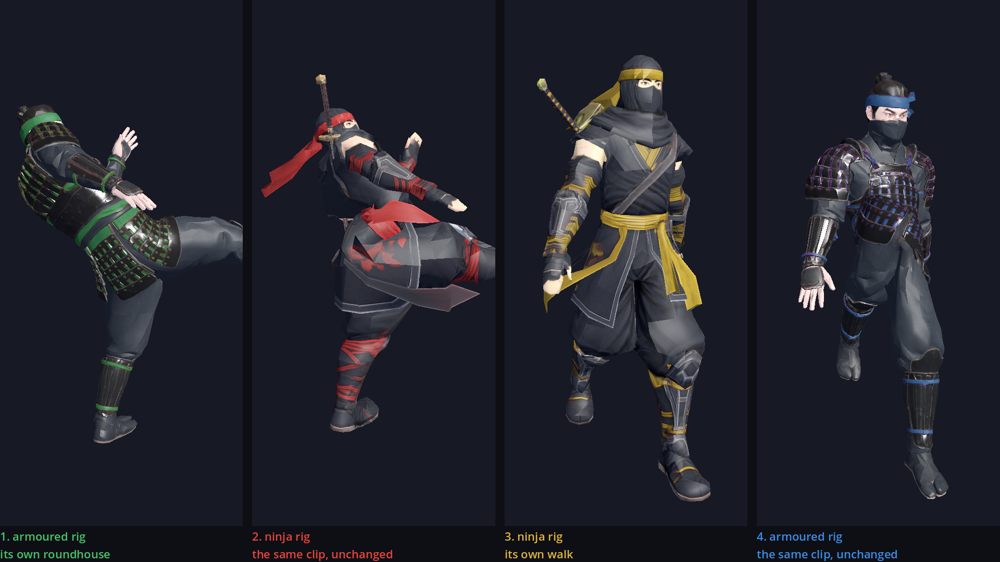

# Character models and animation packs

A character's body is data: a `CharacterVisual` resource holding a model, an
animation library, and how to recolour it. A ninja wears one by pointing its
`.tres` at one. Nothing in `fighter.gd` knows which model it is driving.

```
src/characters/character_visual.gd       the resource
src/characters/visuals/ninja.tres        the default body
src/characters/visuals/armored_ninja.tres Kurogane's
assets/characters/<pack>/                model .glb, clips, library .res
```

| Pack | Model | Clips | Worn by |
|---|---|---|---|
| `ninja` | 1.69 m, one albedo map | 10, one .glb each | everyone but Kurogane |
| `armored_ninja` | 1.75 m, albedo + normal + ORM at 2K | 15, all in the model .glb | Kurogane |

---

## Are the animations tied to the model?

**Not to the mesh — but they are tied to the rig in two ways, and both bite
silently.** A clip is skeleton bone tracks, so it carries no dependency on the
mesh, the texture, or the character's proportions. `strip_animation_glb.py`
throws the mesh out of every clip export for exactly this reason, which is why
the first pack's ten clips cost 350 KB instead of 63 MB.

What a clip does depend on is:

### 1. The node path it addresses (fixed at build time)

Godot resolves a track by its whole path, and an export names its own rig root:

```
Armature/Skeleton3D:Hips           the ninja pack
target_character/Skeleton3D:Hips   the armored pack
```

Identical bone names, different prefix — and a prefix mismatch resolves
**nothing**. The clip plays happily and moves not one bone. A clip in the ninja
pack sat in the library for weeks doing exactly that; it produced twenty
`couldn't resolve track` warnings per fighter spawn and was mistaken for a
bone-naming problem, which it never was.

`build_animation_library.gd` now rewrites every bone track to `:Bone` and
`FighterVisual` plays clips from an `AnimationPlayer` parented to the
`Skeleton3D`, whose root is therefore the skeleton. After that the prefix is not
part of the question.

### 2. The bone names it addresses

A rebased track says `:Hips`. A rig without a bone called `Hips` has nothing to
put there. Names are the entire contract, and both packs here use the same 24
(Mixamo-style: `Hips`, `Spine/Spine01/Spine02`, `neck`, `Head`, `LeftUpLeg`, and
so on), which is why they are interchangeable.

### What is *not* a problem, despite looking like one

The two rigs' **rest poses** differ by up to 110° at the hips and thighs. That
looks fatal and is not. A bone track stores an **absolute local pose**, which
*replaces* rest rather than adding to it, so the pose carries across exactly and
the rest difference never enters into it.

Measured: play a clip on the rig it was authored on and on the other one, and
the bones land within **14.0° of each other on average — the same 14.0 in both
directions**. That residual is the two bodies being different shapes, one 1.69 m
and lanky, the other 1.75 m and stocky. No rotation fix reaches it; it is not
error, it is anatomy.

There was a `retarget()` in this project that read the pose as a delta from the
source rest and hung it on the target's. It is gone. It moved that 14.0 to 10.3
carrying a walk one way and to 38.2 carrying a kick the other — the signature of
a transform that is wrong and occasionally flattering, since a correct one would
be symmetric. (It corrected for the bone's own rest and not its parent's, which
is not a retarget.) Kurogane's walk is the other pack's walk, dropped in
unchanged.

`tools/compare_retarget.tscn` renders the proof: the same clip on both bodies,
nothing done in between, in both directions.



### So, in practice

| The new pack's rig | What you do |
|---|---|
| Same bone names | Nothing. Share clips freely — `borrow` in the pack spec. Rest poses and proportions may differ; the pose still transfers. |
| Different bone names | Rename the bones on import, or retarget in a DCC tool against a bone map. |
| Different skeleton structure | Retarget in a DCC tool. There is no runtime fix. |

`tools/check_retarget.gd` answers this for a model you already have *or one you
have just downloaded*:

```bash
godot --headless --path . --script res://tools/check_retarget.gd -- res://path/to/any.glb
```

It reports which bones are shared, plays one of each pack's real clips on both
rigs, and prints how far apart they land. With no argument it checks the packs
that ship here and runs as part of `./run_tests.sh` — because no test suite can
tell a fighter standing still from a fighter playing an animation that moves no
bones.

---

## What a pack has to supply

1. **A model `.glb`** — one skinned mesh. An albedo map is the minimum; normal
   and ORM maps are used when present. The recolour shader rotates the hue of
   the texture's *saturated* pixels, leaving skin and dark armour alone, so the
   pack declares which hue its accents sit at (`source_hue`). A texture whose
   character colour is near-grey cannot be recoloured this way — near-grey
   pixels have a meaningless hue that explodes when rotated.
2. **Clips named what the movesets name**, or a moveset of its own. Clip names
   are the contract; the builder's `alias` map points the names the game asks
   for at whatever the pack called them.

`borrow` in a pack spec pulls a clip in from another pack, unchanged — that is
what Kurogane's walk is.

The moveset also carries **when contact happens** in each clip, in seconds, and
that number is specific to the clip it was measured on. Two packs animating the
same punch at different times need different slices — which is why Kurogane has
his own moveset (`src/combat/movesets/armored.tres`): identical frame data to
`standard.tres`, different clips and slices. `tools/analyse_impacts.gd` finds
the contact moments by sampling every frame and reporting where each hand
reaches furthest from the hips and each foot goes highest.

Clips the game asks for:

```
walk  run                                     locomotion
punch_combo  double_kick  roundhouse_kick      strikes
shoulder_throw                                grab
spin_jump                                     air heavy / slam
run_alt  run_fast                             spares
```

A pack missing one is not fatal — the move plays no animation and everything
else about it still works.

---

## Adding one

```bash
# 1. Drop the exports in place
assets/characters/<pack>/<pack>.glb                 model, or model + clips
assets/characters/<pack>/animations/<clip>.glb      if clips ship separately

# 2. Separate clip files only: strip the mesh out of each (6.3 MB -> ~35 KB)
python3 tools/strip_animation_glb.py raw/<clip>.glb assets/characters/<pack>/animations/<clip>.glb

# 3. Describe the pack in tools/build_animation_library.gd (PACKS), then
godot --headless --path . --script res://tools/build_animation_library.gd -- <pack>

# 4. Check it resolves and whether it can share clips with the others
godot --headless --path . --script res://tools/check_retarget.gd

# 5. Find the contact moments, for the moveset's slices
godot --headless --path . --script res://tools/analyse_impacts.gd -- <pack> <clip>...

# 6. Author the body, and a moveset if the timings differ
src/characters/visuals/<pack>.tres
src/combat/movesets/<pack>.tres

# 7. Point one ninja at them
src/characters/roster/<name>.tres      visual = ..., move_set = ...
```

`model_scale` puts the model's height onto the 1.8 m collision capsule —
`check_retarget.gd` prints each model's height, so the number is measured rather
than guessed. `faces_positive_z` is true for a model authored with its toes
pointing +Z, which the game turns to meet Godot's -Z forward. Get either wrong
and it is obvious the first time you look, which is what
`tools/capture_screenshots.tscn` is for.

---

## Not yet wired

`assets/characters/armored_ninja/headband_tails.glb` and its wind shader ship
with the pack and are not attached to anything. The pack's own actor script
hung them off the `Head` bone at `(0, 1.64, -0.10)` and drove them with a vertex
wind shader. Doing that here means a `CharacterVisual` field for an attachment
mesh, a bone, and an offset, plus a per-frame transform in `FighterVisual`. It
is cosmetic, so it waits.
